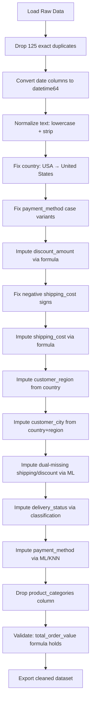

# Data Quality Audit Report

**Dataset:** E-Commerce Orders  
**Source:** `data/raw/orders.csv`  
**Audit Date:** 2026-09-07  
**Notebook Reference:** `notebooks/data_quality_audit.ipynb`

---

## 1. Dataset Overview

| Metric | Value |
|--------|-------|
| **Rows** | 50,125 |
| **Columns** | 27 |
| **Memory Usage** | 10.3 MB |
| **Primary Key (Business)** | `order_id` |
| **Foreign Key** | `customer_id` → customers table |

---

## 2. Data Types

| Column | Current Type | Expected Type | Notes |
|--------|--------------|---------------|-------|
| `order_id` | str | str | Business key |
| `customer_id` | str | str | Foreign key |
| `order_date` | str | datetime64 | Requires conversion |
| `ship_date` | str | datetime64 | Requires conversion; 17% missing |
| `delivery_date` | str | datetime64 | Requires conversion; 26% missing |
| `customer_name` | str | str | 1,004 values need whitespace trimming |
| `customer_segment` | str | category | 3 categories: Consumer, Corporate, Small Business |
| `customer_country` | str | category | 6 values; USA/United States duplication |
| `customer_city` | str | category | 16 cities; 2% missing |
| `customer_region` | str | category | 3 regions; 1% missing |
| `order_status` | str | category | 5 statuses |
| `total_items` | int64 | int64 | Range: 1–12 |
| `unique_products` | int64 | int64 | Range: 1–10 |
| `product_categories` | str | — | Text field; drop for order-level analysis |
| `subtotal` | float64 | float64 | Min: 4.36, Max: 1,612.35 |
| `discount_amount` | float64 | float64 | 2% missing; 381 zeros recorded as NaN |
| `shipping_cost` | float64 | float64 | 1% missing; 123 negative values (data entry error) |
| `tax_amount` | float64 | float64 | Complete |
| `total_order_value` | float64 | float64 | Complete |
| `profit` | float64 | float64 | Complete |
| `shipping_method` | str | category | 4 methods |
| `delivery_status` | str | category | 5 statuses; 1% missing |
| `payment_method` | str | category | 15 raw values; case inconsistency; 0.8% missing |
| `payment_status` | str | category | 4 statuses |
| `sales_channel` | str | category | 4 channels |
| `customer_acquisition_channel` | str | category | 6 channels |
| `campaign` | str | category | 6 campaigns; 82% missing (expected) |

---

## 3. Duplicate Analysis

| Duplicate Type | Count | Resolution |
|----------------|-------|------------|
| Exact row duplicates | 125 | Drop (keep first) |
| `order_id` duplicates | 125 | Same as above; `order_id` is business key |

**Action:** Remove 125 duplicate rows → 50,000 unique orders.

---

## 4. Missing Values Summary

| Column | Missing Count | Missing % | Pattern |
|--------|---------------|-----------|---------|
| `order_id` | 0 | 0.0% | — |
| `customer_id` | 0 | 0.0% | — |
| `order_date` | 0 | 0.0% | — |
| `ship_date` | 8,548 | 17.0% | Systematic: all Cancelled/Processing orders |
| `delivery_date` | 13,434 | 26.8% | Includes all missing ship_date + Shipped orders |
| `customer_name` | 0 | 0.0% | 1,004 need whitespace trimming |
| `customer_segment` | 0 | 0.0% | — |
| `customer_country` | 0 | 0.0% | USA/United States semantic duplicate |
| `customer_city` | 1,002 | 2.0% | Random; imputable from country/region |
| `customer_region` | 752 | 1.5% | Random; imputable from country |
| `order_status` | 0 | 0.0% | — |
| `total_items` | 0 | 0.0% | — |
| `unique_products` | 0 | 0.0% | — |
| `product_categories` | 0 | 0.0% | Drop column |
| `subtotal` | 0 | 0.0% | — |
| `discount_amount` | 1,004 | 2.0% | 381 are true zeros; rest computable via formula |
| `shipping_cost` | 602 | 1.2% | 123 negative (fix sign); 12 missing with discount_amount |
| `tax_amount` | 0 | 0.0% | — |
| `total_order_value` | 0 | 0.0% | — |
| `profit` | 0 | 0.0% | — |
| `shipping_method` | 0 | 0.0% | — |
| `delivery_status` | 501 | 1.0% | Predictable from order_status/ship_date |
| `payment_method` | 401 | 0.8% | Case inconsistency + missing; ML imputation |
| `payment_status` | 0 | 0.0% | — |
| `sales_channel` | 0 | 0.0% | — |
| `customer_acquisition_channel` | 0 | 0.0% | — |
| `campaign` | 41,572 | 82.9% | Expected: campaigns run short periods |

---

## 5. Key Data Quality Issues & Remediation Plan

### 5.1 Critical Issues (Must Fix)

| Issue | Affected Rows | Root Cause | Remediation |
|-------|---------------|------------|-------------|
| **125 exact duplicates** | 125 | Data ingestion | Drop duplicates on `order_id` |
| **Date columns as strings** | 50,125 | Schema | Convert `order_date`, `ship_date`, `delivery_date` to `datetime64` |
| **Negative shipping_cost** | 123 | Data entry sign error | Absolute value; validate via `total_order_value = subtotal + shipping_cost + tax_amount - discount_amount` |
| **Missing ship_date/delivery_date** | 8,548 / 13,434 | Business logic: Cancelled/Processing orders never ship | Keep as NaN; derive `delivery_status` = "Not Shipped" |
| **payment_method case inconsistency** | 49,724 | No input normalization | Lowercase all; map variants (credit card, Credit Card, CREDIT CARD → credit_card) |

### 5.2 High-Priority Issues

| Issue | Affected Rows | Root Cause | Remediation |
|-------|---------------|------------|-------------|
| **customer_name whitespace** | 1,004 | Input trimming | `.str.strip()`; optionally `.str.title()` |
| **customer_country semantic duplicate** | 823 (USA) | Inconsistent entry | Map "USA" → "United States"; lowercase all |
| **discount_amount missing** | 1,004 | Partial capture | Compute: `discount = subtotal + shipping_cost + tax_amount - total_order_value`; 381 resolve to 0 |
| **shipping_cost missing** | 602 | Partial capture | After discount imputation, compute via same formula; 12 dual-missing → ML imputation (KNN/RandomForest) |
| **customer_city missing** | 1,002 | Incomplete capture | Impute from `customer_country` + `customer_region` mode |
| **customer_region missing** | 752 | Incomplete capture | Impute from `customer_country` mapping |
| **delivery_status missing** | 501 | Partial capture | Classification model using `order_status`, `ship_date`, `shipping_method` |

### 5.3 Low-Priority / Acceptable

| Issue | Affected Rows | Notes |
|-------|---------------|-------|
| **campaign 82.9% missing** | 41,572 | Expected: campaigns are time-limited; keep for campaign-specific analysis only |
| **product_categories text field** | 50,125 | Not needed for order-level analysis; drop column |

---

## 6. Recommended Cleaning Workflow

---

## 7. Validation Rules (Post-Cleaning)

| Rule | Expected |
|------|----------|
| `total_order_value == subtotal + shipping_cost + tax_amount - discount_amount` | 100% match |
| `shipping_cost >= 0` | 100% true |
| `discount_amount >= 0` | 100% true |
| `discount_amount <= total_order_value` | 100% true |
| `total_items > 0` | 100% true |
| `unique_products > 0` | 100% true |
| `profit <= total_order_value` | 100% true |
| `order_id` unique | 50,000 distinct |
| No missing values in: `order_id`, `customer_id`, `order_date`, `customer_name`, `customer_segment`, `customer_country`, `order_status`, `total_items`, `unique_products`, `subtotal`, `tax_amount`, `total_order_value`, `profit`, `shipping_method`, `payment_status`, `sales_channel`, `customer_acquisition_channel` | 100% complete |

---

## 8. Summary Statistics (Post-Cleaning Target)

| Metric | Target |
|--------|--------|
| Final row count | 50,000 |
| Complete columns | 24/27 (excl. `ship_date`, `delivery_date`, `campaign`) |
| Columns with <1% missing | 24 |
| Data type consistency | 100% |
| Business rule violations | 0 |

---

**Prepared by:** Data Quality Audit Notebook  
**Next Step:** Execute cleaning pipeline in `notebooks/data_cleaning.ipynb`