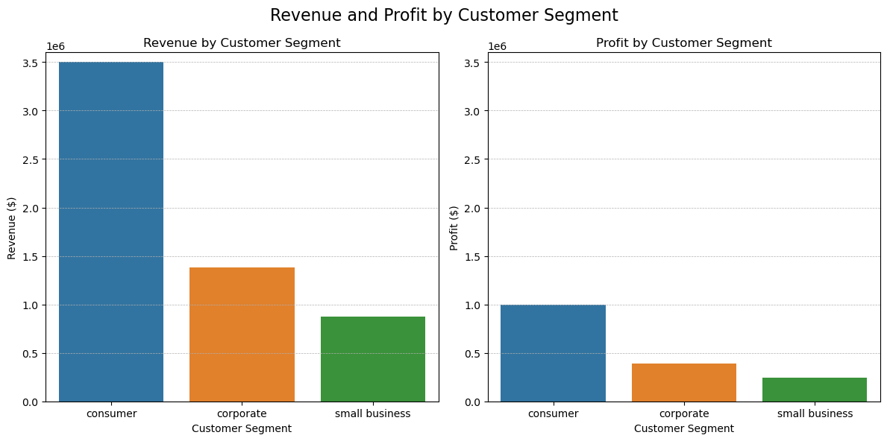

# 01. Overall Sales Performance — Baseline

## Business Question

**How is the overall sales performance evolving?**

## Objective

Establish the overall sales and profitability baseline across the full dataset to provide a reference point for subsequent time-based and segment-level analysis.

## Key Metrics

| Metric                    |      Result |
| ------------------------- | ----------: |
| Total Revenue             |  **$5.76M** |
| Total Orders              |  **49,093** |
| Total Items Sold          | **161,370** |
| Average Order Value (AOV) | **$117.23** |
| Revenue per Item          |  **$35.66** |
| Total Profit              |  **$1.64M** |
| Profit Margin             |  **28.45%** |

## Interpretation

The business generated **$5.76M in revenue from 49,093 orders**, selling approximately **161K items** during the analyzed period.

The average order generated **$117.23 in revenue**, while each item generated approximately **$35.66 in revenue** on average. With **$1.64M in total profit** and a **28.45% profit margin**, the business retained approximately **$0.28 of profit for every $1.00 of revenue**.

Overall, the results indicate a **strong baseline level of sales activity and profitability**. However, these aggregate figures alone do not show whether sales performance is **improving, declining, or remaining stable over time**.

## Business Implication

This baseline provides the reference point for deeper analysis of **sales trends, customer segments, product performance, and geographic performance**. In particular, the next step should be to examine revenue, order volume, AOV, and profit **over time** to determine the direction and drivers of business performance.

## Conclusion

**The business generated $5.76M in revenue and $1.64M in profit at a 28.45% margin across 49,093 orders.** The overall business is profitable with an average order value of $117.23. However, determining how sales performance is *evolving* requires a time-series analysis rather than aggregate totals alone.

# 02. Which customer segments generate the most revenue and profit?

### Key Finding

The **Consumer segment is the largest revenue and profit contributor**, generating **$3.50M in revenue** and **$996.45K in profit**. It accounts for **60.8% of all orders** and contributes approximately **61.5% of total profit**.

The **Corporate segment** ranks second, generating **$1.38M in revenue** and **$393.25K in profit**, while **Small Business** generates **$871.41K in revenue** and **$247.63K in profit**.

### Segment Performance

| Segment            |  Revenue | Order Share |   Profit | Profit Margin |
| ------------------ | -------: | ----------: | -------: | ------------: |
| **Consumer**       |   $3.50M |       60.8% | $996.45K |         28.5% |
| **Corporate**      |   $1.38M |       24.0% | $393.25K |         28.5% |
| **Small Business** | $871.41K |       15.2% | $247.63K |         28.4% |

### Interpretation

* **Consumer is the dominant segment by scale**, generating more than half of total revenue, orders, and profit.
* **Corporate is the second-largest contributor**, while Small Business contributes the least in absolute revenue and profit.
* The segments have **very similar AOVs (~$117)** and **profit margins (~28.4–28.5%)**. Therefore, the substantial differences in total revenue and profit are primarily associated with **order volume rather than materially different transaction economics**.
* Consumer's strong performance is therefore driven mainly by its much larger customer/order volume rather than higher value per order or a superior profit margin.

### Business Implication

The Consumer segment should remain a **primary focus for revenue and profit retention and growth**, given its substantial contribution to overall business performance. At the same time, the relatively similar AOV and profit margins across segments suggest that **increasing order volume within Corporate and Small Business could provide additional growth opportunities without requiring fundamentally different unit economics**.

### Conclusion

**Consumer is the most valuable customer segment in absolute terms**, contributing the largest share of both revenue and profit. However, **no segment demonstrates a meaningful advantage in AOV or profit margin**. The key differentiator between segments is therefore **sales volume**, making order growth and customer acquisition/retention the most relevant areas for further segment-level analysis.

SQL results:

rank | customer_segment | revenue | orders | orders_percentage | AOV | profit | profit_margin
--- | --- | --- | --- | --- | --- | --- | ---
1 | consumer | $3,502,369.34 | 29863 | %60.8 | $117.28 | $996,450.15 | 0.285
2 | corporate | $1,381,734.68 | 14631 | %24.0 | $117.28 | $393,250.00 | 0.285
3 | small_business | $871,410.42 | 15219 | %15.2 | $117.28 | $247,630.00 | 0.284
