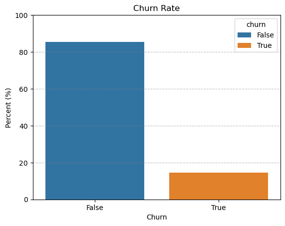
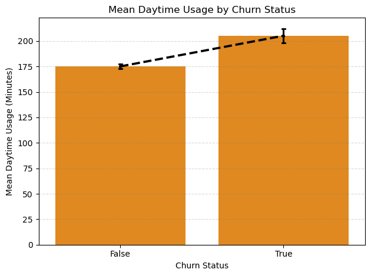
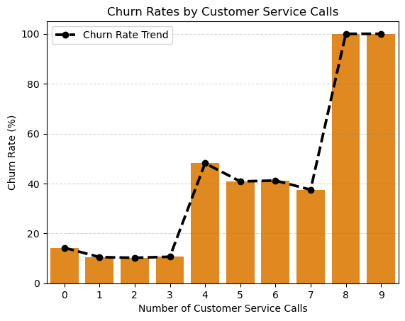
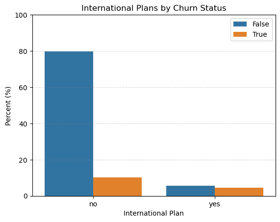
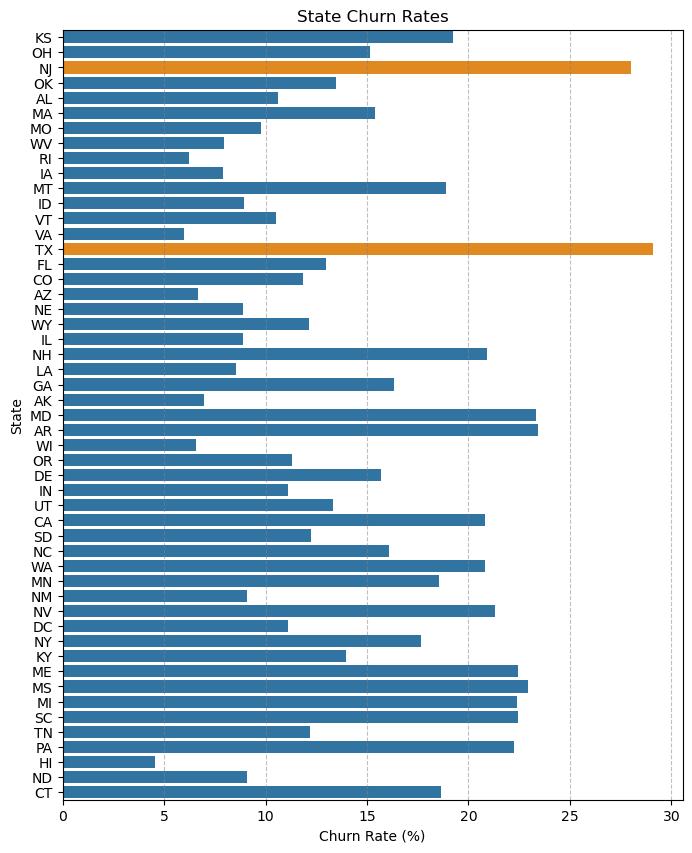
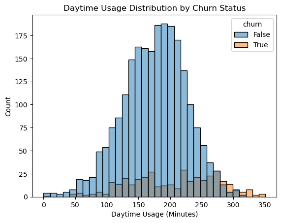
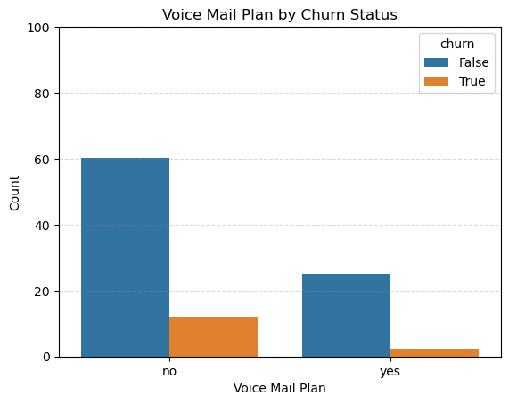
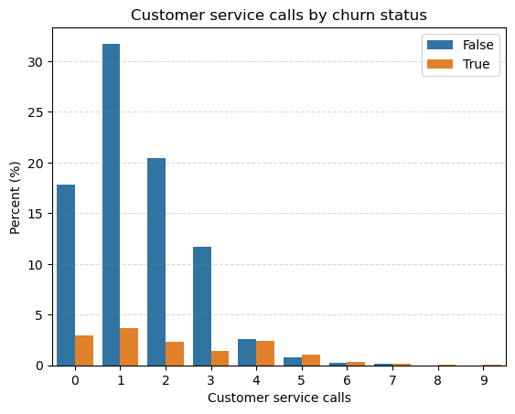
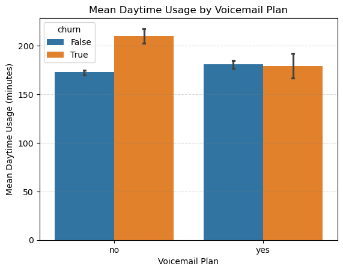
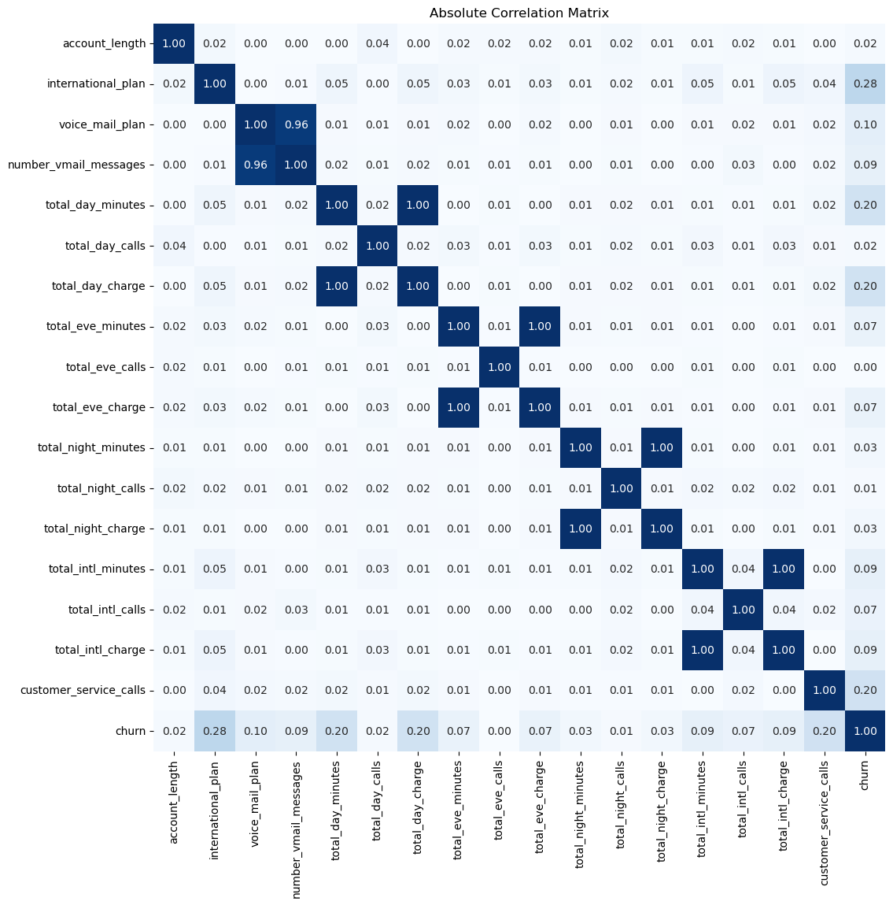

# Telecom Customer Intelligence & Churn Analysis

## Exploratory Data Analysis & Business Insights

## 1. Executive Summary

This analysis investigates customer churn behavior using a telecommunications customer dataset containing **2,666 customers** and **20 features** covering customer tenure, usage, service plans, customer-service interactions, geography, and churn status.

The overall observed churn rate is **14.55%**, meaning that churned customers represent a minority of the customer base but a sufficiently large segment for targeted retention analysis.

The strongest patterns identified during EDA are:

1. **Customer-service interactions show a strong nonlinear association with churn.** Churn remains around 10–14% for customers with 0–3 service calls but increases sharply to **48.12% at four calls**.
2. **International-plan customers have substantially higher observed churn:** **43.70%** compared with **11.27%** for customers without the plan.
3. **Churned customers have higher daytime usage.** Mean daytime usage is **205.18 minutes** for churned customers versus **175.10 minutes** for retained customers.
4. **Voicemail-plan customers show lower observed churn:** **8.87%** versus **16.71%** for customers without the plan.
5. **Account length shows little separation between churned and retained customers**, suggesting that tenure alone is not a strong descriptive segmentation variable in this dataset.
6. **Geographic churn rates vary across states**, but state should be treated as an exploratory segmentation variable rather than a causal factor.
7. **Customer characteristics interact.** In particular, the relationship between daytime usage and churn differs depending on voicemail-plan status, suggesting that single-variable analysis does not fully capture customer risk.

Overall, the EDA suggests that churn is associated more strongly with **service experience, plan characteristics, and usage intensity** than with simple tenure or area-code differences.

> **Important:** These are observational associations. The analysis does not establish that any individual factor causes customers to churn.

---

# 2. Business Objective

The objective of this analysis is to understand:

* Which customer characteristics are associated with churn?
* Which behaviors distinguish churned and retained customers?
* Which products or services are associated with different churn rates?
* Whether customer-service interactions provide an actionable churn signal.
* Whether geographic differences remain useful for customer segmentation.
* Whether combinations of characteristics identify concentrated churn segments.

The findings will subsequently support the **customer churn prediction phase**, where these variables can be evaluated jointly using supervised machine-learning models.

---

# 3. Dataset & Analytical Approach

### Dataset

| Property     | Description                                              |
| ------------ | -------------------------------------------------------- |
| Observations | 2,666 customers                                          |
| Target       | `churn`                                                  |
| Target type  | Binary                                                   |
| Churned      | 14.55%                                                   |
| Retained     | 85.45%                                                   |
| Features     | Customer, usage, plan, support and geographic attributes |

The dataset contains:

* **Customer information:** state, area code, account length
* **Plan information:** international plan, voicemail plan
* **Usage:** day, evening, night and international minutes/calls
* **Charges:** day, evening, night and international charges
* **Support interaction:** customer-service calls
* **Target:** churn

### Preprocessing

The EDA workflow standardizes categorical values, converts categorical variables to categorical data types, validates non-negative usage and call measures, and separates churned and retained customers for comparative analysis.

The analysis is primarily **descriptive EDA**, using:

* distributions
* group-level descriptive statistics
* churn-rate comparisons
* categorical segmentation
* correlation analysis
* interaction-based segmentation

No causal inference is performed.

---

# 4. Overall Churn

## 4.1 What proportion of customers churn?

The observed churn rate is:

| Customer status |      Share |
| --------------- | ---------: |
| Retained        | **85.45%** |
| Churned         | **14.55%** |

### Insight

Approximately one in seven customers in the dataset churned.

The churn class is therefore imbalanced, which should be considered in the subsequent machine-learning stage. Model evaluation should not rely on accuracy alone; metrics such as **precision, recall, F1-score, ROC-AUC and especially PR-AUC** should also be considered.



---

# 5. Customer Behavior

## 5.1 Do churned customers use the service differently?

Daytime usage shows a noticeable difference between churned and retained customers.

| Metric                 |    Churned | Retained |
| ---------------------- | ---------: | -------: |
| Mean daytime minutes   | **205.18** |   175.10 |
| Median daytime minutes | **214.95** |   177.90 |

### Insight

Churned customers tend to have **higher daytime usage** than retained customers.

This makes daytime usage a potentially useful churn-risk feature. However, usage intensity alone does not explain churn, and the relationship should be evaluated jointly with plans and service interactions during modeling.





---

## 5.2 Does international usage associate with churn?

Mean international minutes are relatively close:

| Metric                     | Churned | Retained |
| -------------------------- | ------: | -------: |
| Mean international minutes |  10.819 |   10.138 |

### Insight

Raw international usage shows only a modest difference between churned and retained customers.

This is important because **international-plan membership appears to be a much stronger segmentation variable than international usage volume itself**.

---

## 5.3 Does account length differ between churned and retained customers?

| Metric              | Churned | Retained |
| ------------------- | ------: | -------: |
| Mean account length |  102.32 |   100.33 |

### Insight

The difference in average account length is small.

Therefore, **customer tenure alone does not appear to strongly distinguish churned from retained customers** in this dataset.

This suggests that retention analysis should focus more on current customer behavior and service characteristics than simply on how long a customer has been active.

---

# 6. Products & Services

## 6.1 International plan

Observed churn rates:

| International plan | Churn rate |
| ------------------ | ---------: |
| No                 | **11.27%** |
| Yes                | **43.70%** |

### Insight

Customers with an international plan have a substantially higher observed churn rate.

The difference is large enough to make international-plan membership an important variable for both **customer segmentation and churn prediction**.

However, this result does not demonstrate that the plan itself causes churn. Possible explanations include differences in customer profiles, pricing, usage patterns, or other correlated characteristics.



---

## 6.2 Voicemail plan

Observed churn rates:

| Voicemail plan | Churn rate |
| -------------- | ---------: |
| No             | **16.71%** |
| Yes            |  **8.87%** |

### Insight

Customers with a voicemail plan show a lower observed churn rate than customers without one.

The result suggests that voicemail-plan status contains useful segmentation information.

However, the analysis does not establish that adding voicemail would reduce churn. The difference may reflect underlying customer characteristics associated with plan adoption.

---

## 6.3 Voicemail usage

The number of voicemail messages does not show a comparably strong separation between churned and retained customers.

### Insight

This creates an important distinction:

> **Having the voicemail plan appears more informative than the amount of voicemail usage.**

This suggests that **product membership** may capture customer characteristics that raw usage intensity does not.

---

# 7. Customer Support

## 7.1 Customer-service calls and churn

Observed churn rates by number of customer-service calls:

| Service calls | Churn rate | Sample size |
| ------------: | ---------: | ----------: |
|             0 |     14.23% |         555 |
|             1 |     10.48% |         945 |
|             2 |     10.20% |         608 |
|             3 |     10.63% |         348 |
|         **4** | **48.12%** |     **133** |
|             5 |     40.82% |          49 |
|             6 |     41.18% |          17 |
|             7 |     37.50% |           8 |
|             8 |       100% |           1 |
|             9 |       100% |           2 |

### Insight

The most notable pattern in the EDA is the **sharp increase in observed churn beginning at four customer-service calls**.

Customers with four calls have a **48.12% observed churn rate**, compared with approximately 10–14% for customers with 0–3 calls.

This pattern is consistent with the possibility that repeated customer-service interactions reflect unresolved problems or dissatisfaction.

However:

> **The dataset cannot establish whether repeated service interactions cause churn or whether customers who are already dissatisfied simply contact support more frequently.**

The 8- and 9-call groups should not be interpreted independently because their sample sizes are only **1 and 2 customers**.

### Business implication

Customer-service-call frequency is a strong candidate for:

* churn-risk monitoring
* retention segmentation
* customer-experience investigation
* predictive modeling

A practical exploratory segmentation is therefore:

**0–3 calls vs ≥4 calls**

rather than treating every high-call category independently.

---

# 8. Geographic Patterns

## 8.1 Does churn vary across states?

The EDA shows meaningful variation in observed churn rates across states.

Some states exhibit considerably higher observed churn than the overall dataset.

### Insight

Geographic variation can be useful for identifying **segments requiring further investigation**, but state should not automatically be interpreted as a causal driver.

Potential explanations include:

* differences in customer mix
* differences in usage behavior
* differences in plan adoption
* differences in service experience
* sampling variation

Therefore, state is best treated as an **exploratory segmentation variable**.



---

## 8.2 High-churn state combinations

The analysis identified several state-level groups with 100% observed churn.

However, the combined population behind these extreme observations is only **195 customers**, distributed across many small subgroups:

```text
[6, 2, 1, 1, 4, 2, 2, 3, 1, 3, 1, 1, 2, 2, 1]
```

Consequently, individual 100% rates are often based on very small samples.

### Reporting decision

These extreme state-level rates should **not** be presented as reliable estimates of population churn.

Instead:

> Some state-level subgroups exhibit extreme observed churn rates, but many are based on very small samples and should be treated as exploratory signals rather than stable business estimates.

---

# 9. Interaction Effects

## 9.1 Usage × plan

The relationship between daytime usage and churn differs according to voicemail-plan status.

| Voicemail plan | Retained median day minutes | Churned median day minutes |
| -------------- | --------------------------: | -------------------------: |
| No             |                      175.90 |                 **225.90** |
| Yes            |                      183.35 |                     172.10 |

### Insight

Among customers **without a voicemail plan**, churned customers show substantially higher daytime usage.

Among customers **with a voicemail plan**, this difference is not observed in the same direction.

This suggests a potential **usage × plan interaction** that would be worth testing formally during the modeling phase.

A single-variable conclusion such as "higher usage means higher churn" therefore does not fully describe the observed behavior.

---

# 10. High Usage × Customer-Service Interactions

The analysis defines high-usage customers using daytime usage above the overall mean.

Their observed churn rate is:

**17.25%**

compared with the overall:

**14.55%**

### Insight

High daytime usage alone is associated with only a moderate increase in observed churn.

However, when high usage is examined jointly with customer-service interactions, the analysis identifies more concentrated churn segments.

This supports the broader conclusion that **customer behavior is multidimensional**: usage intensity and service experience should be considered together rather than independently.

---

# 11. High-Churn Combinations

The EDA identified several combinations with 100% observed churn.

These combinations should be interpreted carefully because some have very small sample sizes.

The more useful high-volume combinations include:

* `international_plan = True`
* `voice_mail_plan = False`
* `customer_service_calls = 0` → **54 customers**
* `international_plan = True`
* `voice_mail_plan = False`
* `customer_service_calls = 2` → **38 customers**

These are considerably more informative than state-specific combinations based on one or two customers.

### Insight

The combination of **international-plan membership and absence of a voicemail plan** appears to define a meaningful customer segment for further churn investigation.

The customer-service-call dimension adds another useful segmentation layer.

However, because the reported rates are still descriptive subgroup rates, these combinations should be validated using:

* confidence intervals
* statistical tests
* multivariate modeling
* out-of-sample validation

before being converted into operational retention rules.

---

# 12. Consolidated Business Insights

| Area                         | Finding                                 | Business relevance                                           |
| ---------------------------- | --------------------------------------- | ------------------------------------------------------------ |
| Overall churn                | **14.55% churn**                        | Establishes baseline churn and class imbalance               |
| Day usage                    | Churned mean = **205.18 min** vs 175.10 | Usage intensity is a potential churn signal                  |
| International plan           | **43.70% vs 11.27%**                    | Strong customer-segmentation signal                          |
| International usage          | 10.819 vs 10.138 mean minutes           | Raw usage difference is relatively small                     |
| Voicemail plan               | **8.87% vs 16.71%**                     | Plan membership is associated with different churn behavior  |
| Voicemail usage              | No strong separation                    | Product ownership appears more informative than usage volume |
| Account length               | 102.32 vs 100.33 mean                   | Limited standalone segmentation value                        |
| Service calls                | **48.12% at 4 calls**                   | Strong candidate for churn-risk monitoring                   |
| State                        | Meaningful variation                    | Useful for exploratory segmentation                          |
| High usage                   | **17.25% churn**                        | Moderate association; not sufficient alone                   |
| Usage × voicemail            | Different patterns by plan              | Potential interaction effect                                 |
| International + no voicemail | Larger high-risk segment                | Useful candidate for deeper segmentation                     |

---

# 13. Business Implications

The EDA suggests four main areas for customer-intelligence development.

### 13.1 Customer-experience monitoring

Repeated customer-service interactions are one of the strongest observed churn signals.

A future operational system could monitor customers crossing a defined service-interaction threshold and evaluate whether unresolved issues are concentrated in this segment.

The threshold should be validated statistically and operationally before being implemented as a hard business rule.

### 13.2 Plan-level segmentation

International-plan customers have substantially higher observed churn.

This segment deserves deeper analysis of:

* usage
* charges
* customer-service interactions
* customer characteristics

rather than assuming the plan itself is the cause.

### 13.3 Behavioral segmentation

High daytime usage is associated with higher churn, particularly in some plan segments.

This supports moving beyond simple demographic or tenure-based segmentation toward **behavior-based customer intelligence**.

### 13.4 Predictive churn modeling

The EDA identifies several candidate predictors:

* customer-service calls
* international plan
* voicemail plan
* daytime minutes
* international usage
* account length
* state
* interaction effects

These should now be evaluated jointly using supervised learning.

---

# 14. Limitations

Several limitations should be explicitly acknowledged.

### Observational data

The analysis identifies associations, not causal relationships.

For example:

> Higher customer-service calls are associated with higher churn.

It does **not** establish:

> Customer-service calls cause customers to churn.

### Small subgroups

Some state and interaction combinations contain very few observations.

Observed 100% churn in a subgroup with one or two customers is not evidence that the population churn probability is 100%.

### Multiple comparisons

Examining many states and combinations naturally increases the chance of finding extreme rates by chance.

The most extreme subgroup results should therefore be validated using larger samples and formal statistical methods.

### Static customer snapshot

The dataset represents customer characteristics and behavior at a point in time rather than a longitudinal customer journey.

Therefore, temporal relationships such as:

> service issue → repeated calls → churn

cannot be established from this analysis alone.

### Dataset representativeness

The findings describe this dataset and should not automatically be generalized to a real telecom operator's current customer population without external validation.

---

# 15. Recommended Next Step: Churn Prediction

The EDA provides a strong foundation for the modeling phase.

The next workflow should be:

```text
EDA
 ↓
Feature engineering
 ↓
Train / validation / test split
 ↓
Baseline model
 ↓
Logistic Regression
 ↓
Tree-based models
 ↓
Cross-validation
 ↓
Class-imbalance handling
 ↓
Model evaluation
 ↓
Feature importance / interpretability
 ↓
Threshold selection
 ↓
Customer-risk segmentation
```

### Modeling priorities

Because only **14.55%** of customers churn, accuracy should not be the primary optimization target.

The model evaluation should focus on:

* Recall
* Precision
* F1-score
* ROC-AUC
* PR-AUC
* Confusion matrix
* Calibration
* Business-oriented threshold analysis

The ultimate objective should be to identify customers with elevated churn risk while controlling the cost of unnecessary retention interventions.

---

# 16. Final Conclusion

The EDA shows that churn is not explained by a single customer characteristic.

The strongest observed patterns are concentrated around **customer-service interactions, international-plan membership, usage intensity, and plan combinations**.

The most prominent signal is customer-service interaction frequency: churn remains relatively stable through three calls but increases sharply at four calls. International-plan membership is another major segmentation variable, with a substantially higher observed churn rate among plan users.

At the same time, account length and area code show relatively limited standalone differentiation, while extreme state-level and interaction-level churn rates must be interpreted cautiously because of small subgroup sizes.

The overall implication is that churn analysis should move from **single-variable segmentation toward multivariate customer-risk modeling**, where usage, plans, service interactions, geography, and their interactions are evaluated jointly.

The EDA therefore provides a clear foundation for the next stage:

> **Build and validate a predictive churn model that converts these descriptive patterns into reliable customer-level risk estimates.**

---

## Appendix A — Figures

1. **Overall churn distribution**


2. **Daytime usage distribution by churn status**



3. **International-plan churn rate**


4. **Voicemail-plan churn rate**



5. **Customer-service calls vs churn rate**



6. **State-level churn rates**


7. **Usage × voicemail-plan comparison**



9. **Correlation matrix**



---

## Appendix B — Interpretation Standard

Throughout this report:

**Association** = two variables differ or move together in the observed data.

**Causal effect** = one variable directly changes another variable.

This analysis establishes the former, not the latter.

Extreme subgroup rates are reported as **observed churn rates**, not population probabilities.
