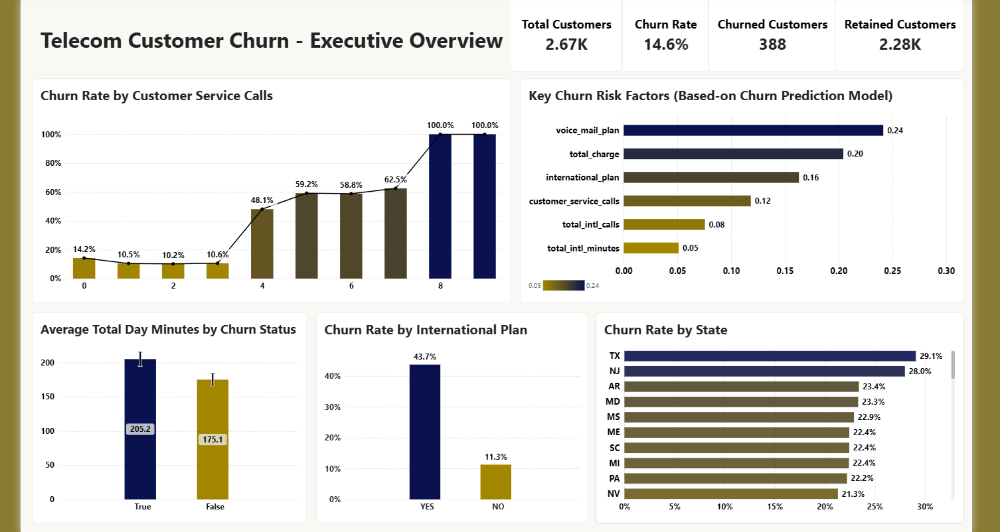

# Telecom Customer Intelligence & Churn Prediction

**Turning telecom customer data into actionable insights through EDA, Power BI, and explainable machine learning.**

## Project Overview

This project investigates customer churn using **2,666 customer records and 20 features**. It combines exploratory data analysis (EDA), business intelligence, and predictive modeling to identify churn-related patterns and support data-driven customer-retention decisions.

The workflow includes data preprocessing, business-oriented analysis, a Power BI dashboard, comparison of Random Forest and XGBoost, and model interpretation. **XGBoost was selected for its superior observed predictive performance.**

## Key Results

| Metric | Result |
|---|---:|
| Overall churn rate | 14.7% |
| International-plan churn rate | 43.6% |
| XGBoost accuracy | 98.1% |
| Precision | 98.8% |
| Recall | 87.4% |
| F1-score | 92.7% |
| ROC-AUC | 98.6% |

*Model metrics are reported for the held-out test set. Accuracy is supplemented with precision, recall, F1-score, and ROC-AUC because the target classes are imbalanced.*

## Key Business Insights

- **International plan:** Customers with the plan exhibit a 43.6% churn rate, compared with 11.2% among customers without it.
- **Customer service:** Observed churn rises to 48.1% among customers with four customer-service calls, highlighting a potential customer-experience risk signal.
- **Daytime usage:** Churned customers average 205.2 daytime minutes versus 175.1 among retained customers.
- **Voicemail plan:** Customers with a voicemail plan exhibit lower observed churn (8.9%) than those without one (16.7%).
- **Feature redundancy:** Charge variables closely track usage minutes and may provide limited independent information.

These findings are observational associations, not evidence of causation. Small customer subgroups require cautious interpretation.

## Power BI Dashboard

The dashboard translates analytical findings into an executive-friendly view of customer churn, subscription segments, and usage behavior.



**Analytical views**
- Overall churn KPIs and customer segmentation.
- Churn rates by international and voicemail plans.
- Customer-service interactions and churn.
- Customer usage and profile comparisons.

## Predictive Modeling

Random Forest and XGBoost were evaluated for binary churn classification. **XGBoost was selected based on its better observed performance.**

| Metric | XGBoost |
|---|---:|
| Accuracy | 98.1% |
| Precision | 98.8% |
| Recall | 87.4% |
| F1-score | 92.7% |
| ROC-AUC | 98.6% |

The results indicate strong test-set discrimination and high precision. Recall of 87.4% means that some actual churners remain undetected, making threshold selection important for retention applications.

Model explainability is used to investigate feature contributions and connect model predictions with the patterns identified during EDA. Feature importance should be interpreted as predictive relevance, not causality.

## Workflow

**Data validation → EDA → Business insights → Power BI → Feature engineering → Model comparison → XGBoost evaluation → Model interpretation**

## Tech Stack

- **Programming:** Python
- **Data analysis:** Pandas, NumPy
- **Visualization:** Matplotlib, Seaborn
- **Machine learning:** Scikit-learn, XGBoost
- **Business intelligence:** Microsoft Power BI
- **Development:** Jupyter Notebook

## Repository Structure

```text
.
├── data/
│   ├── raw/
│   ├── processed/
│   └── customer_data_80.md
├── docs/
│   ├── data_card.md
│   └── eda.md
├── figures/
│   └── powerbi-dashboard.png
├── models/
│   └── xgboost_classifier.pkl
├── notebooks/
│   ├── preprocessing.ipynb
│   ├── eda.ipynb
│   └── modeling.ipynb
├── reports/
│   └── project_overview.pdf
├── src/
│   ├── preprocessing.py
│   ├── eda.py
│   ├── visualizations.py
│   └── modeling.py
├── utils/
│   ├── eda.py
│   └── modeling.py
├── requirements.txt
└── README.md
```

## Reproducibility

Clone the repository and install the dependencies:

```bash
git clone https://github.com/Erfan-Taherirani/Data_Science.git
cd "Telecom Customer Intelligence & Churn Prediction"
pip install -r requirements.txt
```

Run the notebooks in preprocessing, EDA, and modeling order. Consult `docs/data_card.md` for dataset details and `docs/eda.md` for the analytical findings.

## Limitations & Future Work

- The static dataset does not establish temporal patterns or causal relationships.
- Validate performance on newer or external data.
- Evaluate PR-AUC, probability calibration, and business-oriented decision thresholds.
- Use SHAP or other suitable explainability methods to interpret predictions.
- Measure the effectiveness and cost of retention interventions.

## Conclusion

This project demonstrates an end-to-end customer analytics workflow, combining descriptive insights, business intelligence, and predictive modeling. By identifying churn-associated customer segments and selecting XGBoost for prediction, it illustrates how data analysis can support more targeted retention decisions.

The next step is operational validation: testing model robustness, interpreting customer-level risk, and measuring whether retention actions improve business outcomes.

---

*Method note: Reported metrics are rounded. EDA findings are associative, and model performance reflects the specified held-out test set.*
